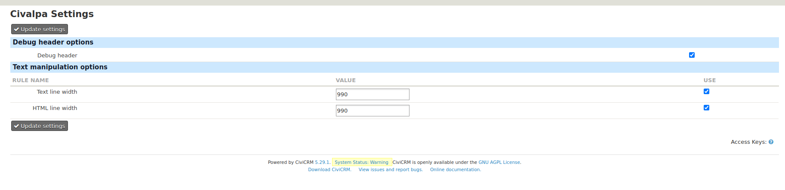

# CivAlPa

[](https://github.com/reflexive-communications/civalpa/actions/workflows/main.yml)

Civimail Alter mail Params extension. It can be used for wrapping the text, html strings, also manipulating headers. The settings form of this extension could be found under `Administer > CiviMail > CivAlPa Settings`. You need to have at lease administer civicrm priv. to be able to check or update the settings.



With the debug header checkbox the `X-CIVALPA-DEBUG` header could be enabled or disabled. This header contains the name of the rules that were applied on the email. For example if the header is enabled and both the text wrap and html wrap rule were applied on the email the header will be set to the following value:

```text
X-CIVALPA-DEBUG: textWrap,htmlWrap,
```

The Text manipulator settings could be used to set a maximum value for the length of the message lines. The text will be wrapped if the use checkbox of the rule is checked.

The extension is licensed under [AGPL-3.0](LICENSE.txt).

## Requirements

* PHP v7.2+
* CiviCRM 5.29+
* [RC-Base](https://github.com/reflexive-communications/rc-base) v0.8.1+

## Installation (Web UI)

Learn more about installing CiviCRM extensions in the [CiviCRM Sysadmin Guide](https://docs.civicrm.org/sysadmin/en/latest/customize/extensions/).

## Installation (CLI, Zip)

Sysadmins and developers may download the `.zip` file for this extension and
install it with the command-line tool [cv](https://github.com/civicrm/cv).

```bash
cd <extension-dir>
cv dl civalpa@https://github.com/reflexive-communications/civalpa/archive/master.zip
```

## Installation (CLI, Git)

Sysadmins and developers may clone the [Git](https://en.wikipedia.org/wiki/Git) repo for this extension and
install it with the command-line tool [cv](https://github.com/civicrm/cv).

```bash
git clone https://github.com/reflexive-communications/civalpa.git
cv en civalpa
```
